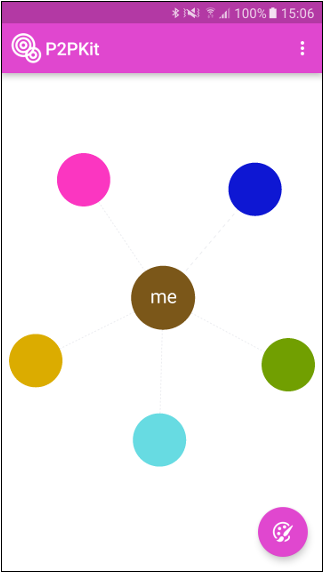

# p2pkit.io Android Quickstart

#### A peer-to-peer proximity SDK for iOS and Android

p2pkit is an easy to use SDK that bundles together several proximity technologies kung-fu style! With p2pkit apps immediately understand their proximity to nearby devices and users, 'verify' their identity, and exchange information with them.



## Get Started

1. Using p2pkit requires an application key, start by creating a p2pkit account here:
[Create p2pkit account](http://p2pkit.io/signup.html)

2. Once you have an account you can log-in to the console and create an application key: [Create your Application Key](https://p2pkit-console.uepaa.ch/login)

> **Note:** p2pkit validates package names so don't forget to add ``ch.uepaa.quickstart`` to the known package names when creating your application key

3. Head to the ``MainActivity.java`` file and replace ``<YOUR APPLICATION KEY>`` with your new key:

  ```
  private static final String APP_KEY = "<YOUR PERSONAL APP KEY>";
  ```

> In general, a tutorial as well as all other documentation is available on the developer section of our website:
[http://p2pkit.io/developer](http://p2pkit.io/developer)


### Get Started Video

[](https://www.youtube.com/watch?v=P10GcELDAmU)

[Watch video here](https://www.youtube.com/watch?v=P10GcELDAmU)


### p2pkit License

* By using p2pkit you agree to abide by our Terms of Service, License Agreement and Policies which are available here: http://p2pkit.io/policy.html
